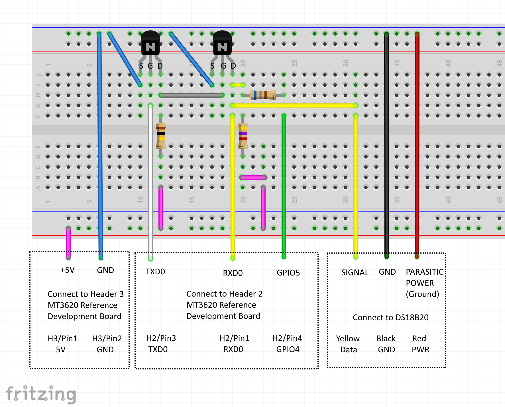

# Sample: OneWire (high-level app)

This sample demonstrates how to communicate over UART on an MT3620 development board to a 
OneWire device.

This sample does the following:
- Opens a UART serial port.
- Opens GPIO port for providing parasitic power to OneWire device. 
- Opens GPIO ports for controlling LED2.
- Sends OneWire commands over the serial port to a DS18B20 temperature sensor.
- Sets the LED2 color based on the temperature.
- Output window of Visual Studio displays temperature data from a DS18B20 temperature sensor.

This sample uses these Applibs APIs:
| Library | Purpose |
|---------|---------|
| [UART](https://docs.microsoft.com/azure-sphere/reference/applibs-reference/applibs-uart/uart-overview) | Manages UART connectivity on the device |
| [GPIO](https://docs.microsoft.com/azure-sphere/reference/applibs-reference/applibs-gpio/gpio-overview) | Manages LED2 and GPIO output pin on the device |
| [log](https://docs.microsoft.com/azure-sphere/reference/applibs-reference/applibs-log/log-overview) | Displays messages in the Device Output window during debugging |
| [EventLoop](https://docs.microsoft.com/azure-sphere/reference/applibs-reference/applibs-eventloop/eventloop-overview) | Invoke handlers for timer events |

## Contents
| File/folder | Description |
|-------------|-------------|
| .vscode | Contains settings.json that configures Visual Studio Code to use CMake with the correct options, and tells it how to deploy and debug the application. |
| app_manifest.json | Sample manifest file. |
| applibs_versions.h | Defines the versions of the data structures used. |
| CMakeLists.txt | Contains the project information and produces the build. |
| CMakeSettings.json| Configures CMake with the correct command-line options. |
| crc8.c | Source file for calculating CRC8 value for validating data from OneWire devices. |
| crc8.h | Header file for calculating CRC8 value for validating data from OneWire devices. |
| ds18b20.c | Source file for communicating with the DS18B20 OneWire temperature sensor. |
| ds18b20.h | Header file for communicating with the DS18B20 OneWire temperature sensor. |
| eventloop_timer_utilities.c | Source file for timed events. |
| eventloop_timer_utilities.h | Header file for timed events. |
| launch.vs.json | Describes how to deploy and debug the application. |
| LICENSE.txt | MIT license file for this project. |
| main.c    | Main sample application source file. |
| onewire.c | Source file for for communicating with OneWire devices. |
| onewire.h | Header file for for communicating with OneWire devices. |
| onewirerom.c | Source file for working with OneWire ROM identifiers. |
| onewirerom.c | Header file for working with OneWire ROM identifiers. |
| onewiresearch.c | Source file for searching for OneWire devices. |
| onewiresearch.h | Header file for searching for OneWire devices. |
| onewireuart.c | Source file for communicating with OneWire devices over a UART and GPIO port. |
| onewireuart.h | Header file for communicating with OneWire devices over a UART and GPIO port. |
| README.md | This readme file. |
| sleep.c | Source file for sleeping a given number of milliseconds. |
| sleep.h | Header file for sleeping a given number of milliseconds. |

## Prerequisites

**Note:** By default, this sample targets [MT3620 reference development board (RDB)](https://docs.microsoft.com/azure-sphere/hardware/mt3620-reference-board-design) hardware, such as the MT3620 development kit from Seeed Studios. 
To build the sample for different Azure Sphere hardware, change the Target Hardware Definition Directory in the CMakeLists.txt file. 
For detailed instructions, see the [README file in the HardwareDefinitions folder](../../../HardwareDefinitions/README.md). 
You may also have to set the hardware differently.

This sample requires the following hardware:

- Azure Sphere MT3620 board
- DS18B20 temperature sensor
- 1x 680 ohm resistor
- 1x 4.7K ohm resistor
- 1x 100K ohm resistor
- 2x 2N7002 transistors
- Breadboard and wires.

It is recommended to put components in a breadboard and run jumper wires for connections, rather than
connect directly to the components.  The breadboard should look like the following figure once completed.
    

NOTE: The DS18B20 is configured to use parasitic power, so the red wire and the black wire *from the sensor* 
will both end up getting connected to ground on the breadboard (using the red wire and the black wire in
the diagram.)

IMPORTANT: Do not connect VCC/+5V (e.g. the pink wires) to GROUND on the breadboard, or you could damage 
your Azure Sphere.  The red wire from the DS18B20 must only be connected to EITHER ground (if you want
parasitic power) or +5 if you want direct power, but MUST NEVER be connected to both a the same time.

- Connect yellow wire from pin 1 (ISU0 RXD) of H2 to Q2 (transistor 2) drain pin.
- Connect an end of the 680 ohm resistor to Q2 (transistor 2) drain pin.
- Connect the other end of the 680 ohm resistor to pin 4 (SAMPLE_NRF52_RESET) of H2 using a green wire.
- Connect the yellow wire (data wire) of the DS18B20 to Q2 (transistor 2) drain pin.
- Connect an end of one of the 4.7K ohm resistor to Q2 (transistor 2) drain pin.
- Connect the other end of the 4.7K ohm resistor to pin 1 (5V VCC) of H3 using a pink wire.
- Connect pin 2 (GND) of H3 to Q2 (transistor 2) source pin using blue wire.
- Connect Q2 (transistor 2) gate pin to Q1 (transistor 1) drain pin using a grey wire.
- Connect an end of the 100K ohm resistor to Q1 (transitor 1) drain pin.
- Connect the other end of the 100K ohm resistor to pin 1 (5V VCC) of H3 using a pink wire.
- Connect pin 2 (GND) of H3 to Q1 (transistor 1) source pin using a blue wire.
- Connect pin 3 (ISU0 TXD) of H2 to Q1 (transistor 1) gate pin using a white wire.

## Prepare the sample

1. Even if you've performed this setup previously, ensure you have Azure Sphere SDK version 20.10 or above. 
At the command prompt, run **azsphere show-version** to check. 
Install [the Azure Sphere SDK](https://docs.microsoft.com/azure-sphere/install/install-sdk) as needed.
1. Connect your Azure Sphere device to your computer by USB.
1. Enable application development, if you have not already done so, by entering the following line at the command prompt:
   `azsphere device enable-development`
1. Clone the [Azure Sphere samples](https://github.com/Azure/azure-sphere-samples/) repo and find the OneWire_HighLevelApp 
sample in the OneWire folder.

## Build and run the sample

To build and run this sample, follow the instructions in [Build a sample application](../../../BUILD_INSTRUCTIONS.md).

### Test the sample

1. Run the sample.  
1. This should display output similar to the following in the Device Output window, if you're using Visual Studio or Visual Studio Code:

	`Remote debugging from host 192.168.35.1, port 56510`
	`OneWire application starting.`
	`INFO: OneWireSkipROM returned true.`
	`INFO: Ds18b20ConvertT returned true.`
	`INFO: OneWireSearchROM returned true.`
	`ROM: 28 96 0d ad 36 19 02 ca` 
	`INFO: OneWireMatchROM returned true.`
	`INFO: Ds18b20ReadPowerSupplyVCC returned OneWire powered.`
	`INFO: OneWireMatchROM returned true.`
	`INFO: Ds18b20ReadScratchpad returned true.`
	`INFO: Resolution is 12 bits.`
	`INFO: tLow is 229.`
	`INFO: tHigh is 121.`
	`INFO: Temp is 73.625F.`
	`INFO: OneWireSearchROM returned true.`

1. The LED2 should change color depending on the temperature:
- Green (between tLow 65F to 75F)
- Red (over 75F)
- Blue (below 65F)
